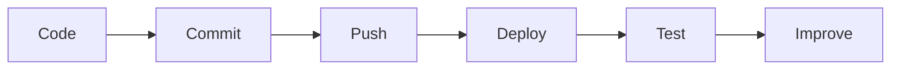

# 👋 Hey there, I'm Ahmed Ezzat!

🚀 **Frontend Developer** | 💡 **Tech Explorer** | ⚛️ **React & Next.js Enthusiast**

---

### 🧠 About Me

- 🎓 Fresh Computer Science graduate with hands-on experience building real-world web apps.
- 📦 Successfully delivered my graduation project: [**Bitary**](https://github.com/Ahmed3zzat/Bitary) — a digital solution for pet healthcare and veterinary services.
- 🏗️ Currently initiating a new real estate project to expand my portfolio.
- 💡 I enjoy building interactive, responsive, and visually appealing UIs while ensuring clean code and great user experiences.
- 🎯 Seeking frontend internship or junior developer roles to grow and contribute.

---

### 🌍 Career Objective

I’m currently looking for a frontend internship or junior developer role where I can grow technically, contribute to creative projects, and continue my journey toward fullstack development.

---

### 🔧 Tech Stack

**Languages & Frameworks**  
`React` • `Next.js` • `JavaScript` • `Tailwind CSS` • `Material-UI` • `Bootstrap` • `Sass` • `jQuery` • `Angular`

**Tools & Platforms**  
`Git` • `GitHub` • `Redux` • `VS Code` • `Postman` • `Vercel` • `Figma`

---

### 🧩 What I’m Learning Now

- 🔄 Advanced React & Next.js Architecture
- ⚙️ Fullstack Integration using APIs
- 🧠 Clean Code & Design Patterns
- 🐘 PostgreSQL, Node.js (Basics)

---

### 🎯 Goals

- 🚀 Launch and scale the Bitary platform
- 💼 Land a remote junior frontend position
- 👨‍💻 Contribute to open-source
- 🧱 Learn backend and move toward fullstack roles

---

### 💼 Featured Projects

#### 1. 🐾 [**Bitary**](https://github.com/Ahmed3zzat/Bitary) – Pet Healthcare Platform  
Full-stack platform with AI chatbot, e-commerce, booking system, and digital pet ID.  
**Tech:** React.js, React Native, Node.js, MongoDB, Python, AWS

#### 2. 📱 [**Jumplin**](https://github.com/Ahmed3zzat/JUMPLN) – Social Media Application  
JWT auth, real-time likes/comments, Firebase backend, profile system.  
🔗 [Live Demo](https://jumplin-app.vercel.app)  
**Tech:** Next.js 14, React, Redux Toolkit, Firebase, MUI

#### 3. 🌱 [**MindBloom Notes**](https://github.com/Ahmed3zzat/MindBloom-note) – Collaborative Note-Taking App  
Real-time collaboration with Supabase backend, smart templates, and AI-ready structure.  
🔗 [Live Demo](https://mindbloom-demo.vercel.app)  
**Tech:** Next.js, Tailwind CSS, Supabase, Redux, Framer Motion

#### 4. 🛒 [**SwiftMart**](https://github.com/Ahmed3zzat/SwiftMart-ecomerce) – Modern E-commerce Platform  
E-commerce with cart, filters, Stripe integration, and fast performance.  
🔗 [Live Demo](https://lnkd.in/dd2Qu_A8)  
**Tech:** React, TypeScript, Tailwind CSS, Stripe, Vite

#### 5. ⛅ [**Weatherify**](https://github.com/Ahmed3zzat/Weatherify) – Real-Time Weather Forecast  
5-day forecast, Redux state management, and clean responsive UI.  
🔗 [Live Demo](https://lnkd.in/dd9rzHkV)  
**Tech:** Next.js 14, Redux Toolkit, TypeScript, Tailwind CSS

#### 6. 💼 [**My Portfolio**](https://github.com/Ahmed3zzat/my-portfolio) – Developer Showcase  
Responsive portfolio with animated transitions and project highlights.  
🔗 [Live Demo](https://lnkd.in/defard6s)  
**Tech:** Next.js, Tailwind CSS, Redux, Framer Motion

#### 7. ⚡ [**ABE-motion**](https://github.com/Ahmed3zzat/ABE-motion) – Framer Motion Showcase  
Smooth animations, page transitions, and UI effects using Framer Motion.  
🔗 [Live Demo](https://lnkd.in/dKBPBXVv)  
**Tech:** Next.js, Tailwind CSS, Framer Motion

#### 8. 🎮 [**GameZone**](https://github.com/Ahmed3zzat/Games-OOP) – Game Reviews Hub  
JavaScript SPA using OOP concepts and game data from a live API.  
🔗 [Live Demo](https://lnkd.in/dMnGjvwj)  
**Tech:** JavaScript ES6, HTML, CSS, REST API

#### 9. 🍽 [**Yummy Meals**](https://github.com/Ahmed3zzat/Yummy-Meals) – Smart Recipe Finder  
Food search and filtering using the Edamam API.  
🔗 [Live Demo](https://lnkd.in/ddb4DWhz)  
**Tech:** jQuery, Bootstrap, HTML, CSS, REST API

#### 10. 🌊 [**Osaka**](https://github.com/Ahmed3zzat/osakaJquery) – Interactive jQuery UI  
Stylish layout with animations and effects using jQuery.  
🔗 [Live Demo](https://lnkd.in/dJ3kf2zX)  
**Tech:** jQuery, JavaScript, HTML, CSS

---

### 📚 Certifications & Training

- 🎓 **Frontend Development Diploma** – Route Academy (Dec 2024, Cairo)  
  [📄 Certificate](https://drive.google.com/file/d/1TsAqWHooiLBFSwxqQLaMO9sn6JDp0ok0/view?usp=drive_link)

- 🔧 **Frontend Development Using Angular** – ITI (Jul 2024, Cairo)  
  [📄 Certificate](https://drive.google.com/file/d/18HUWF77BH7dwWaD6It4qxTFitsu5Q4l5/view?usp=drive_link)

---

### 🛠 My Workflow

---

### 🏆 GitHub Trophies

---

### 📈 GitHub Stats

  

---

### 👁️ Visitors Counter

---

### 🌐 Connect with Me

- 💼 [**LinkedIn**](https://www.linkedin.com/in/ahmed-ezzat-2a1468245)  
- 🌍 [**Portfolio Website**](https://my-portfolio-2q291we0i-ahmedzats-projects.vercel.app/)  
- 📧 **Email:** [ezzat.a2003@gmail.com](mailto:ezzat.a2003@gmail.com)

---

### 🗣️ بالعربي

أنا أحمد عزت، مطور واجهات أمامية بخبرة في React وNext.js، خريج حاسبات ومعلومات، واشتغلت على مشاريع واقعية زي Bitary.  
بطمح أني أشتغل في بيئة محفزة أتعلم فيها أكتر وأسهم في بناء منتجات تحل مشاكل حقيقية وتقدم تجربة مستخدم مميزة.

---

> _"Code is like humor. When you have to explain it, it’s bad."_  
> — **Cory House**
